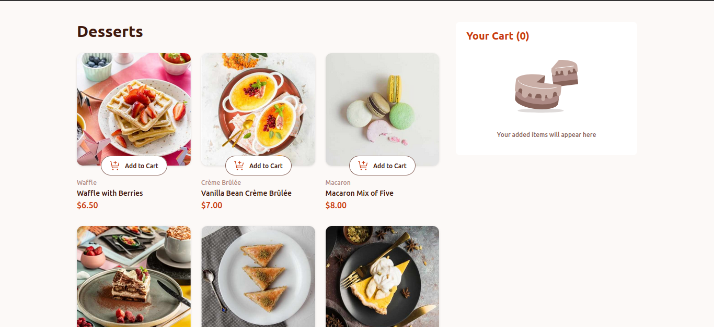
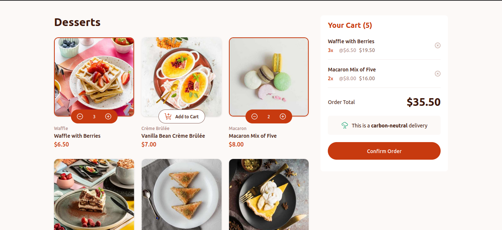
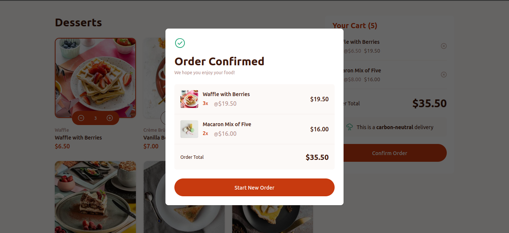

# Frontend Mentor - Social links profile solution

Esta é uma solução para o 
 [Desafio da lista de produtos com carrinho no Frontend Mentor](https://www.frontendmentor.io/challenges/product-list-with-cart-5MmqLVAp_d). Os desafios do Frontend mentor ajudam você a melhorar as suas habilidades de programação através da construção de projetos realísticos.

## Tabela de conteúdos

- [Visão geral](#visão-geral)
  - [O desafio](#o-desafio)
  - [Imagens do projeto feito](#imagens-do-projeto-feito)
  - [Links](#links)
- [Construído com](#construído-com)
- [Autor](#autor)

##  Visão Geral

## O desafio

O desafio consistia em criar uma lista de produtos com carrinho e torná-la o mais próxima possível do design fornecido.

Foi fornecido pelo site os dados dos produtos em um arquivo data.json local. Eu os utilizei para adicionar os dados dinamicamente.

Os usuários são capazes de:

- Adicionar itens ao carrinho e removê-los
- Aumentar/diminuir o número de itens no carrinho
- Ver um modal de confirmação de pedido quando se clica em "Confirm Order"
- Resetar a seleções do usuário quando ele clica em "Start New Order"
- Visualizar o layout ideal para a interface, dependendo do tamanho da tela do dispositivo
- Ver os estados de foco e hover para todos os elementos interativos na página

### Imagens do projeto feito

Imagem do projeto sem selecionar produtos

Imagem do projeto ao selecionar produtos

Imagem do modal de confirmação de do pedido

### Links

- Solução URL: [URL da solução](https://github.com/moisesferreira123/product-list-with-cart-main)
- Live Site URL: [Live site URL](https://moisesferreira123.github.io/roduct-list-with-cart-main/)

## Construído com

- HTML5
- CSS
- JavaScript
- Tailwind CSS
- Visual Studio Code

## Autor

- Frontend Mentor - [@moisesferreira123](https://www.frontendmentor.io/profile/moisesferreira123)
- GitHub - [@moisesferreira123](https://github.com/moisesferreira123)
